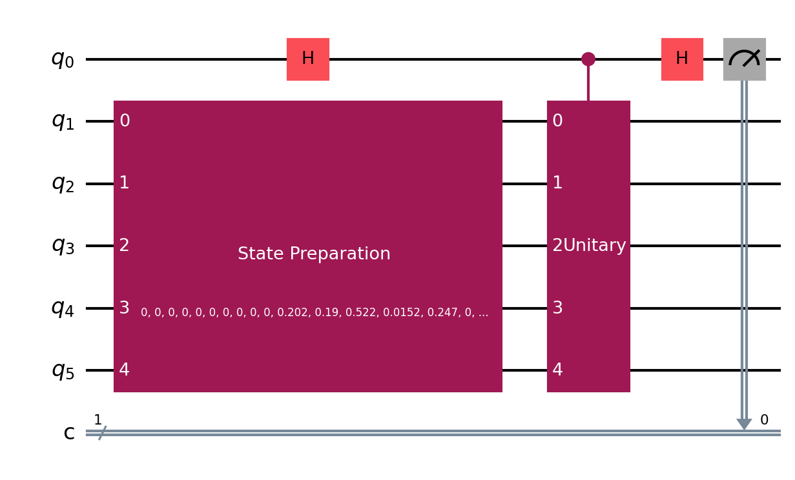
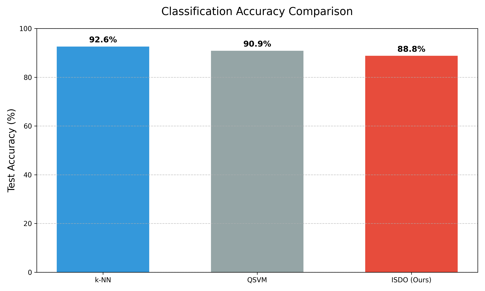

# **Interference-Based Quantum Classification Without Measurement-Driven Training**

## **Abstract**

Quantum machine learning methods often rely on probability estimation, kernel evaluation, or variational circuit training. These steps usually require many measurements and complex optimization, which are difficult to implement on near-term quantum hardware. In this paper, we present a simple quantum classification method based only on quantum interference. The proposed method uses a fixed reference quantum state and determines the class label by the sign of the real part of the inner product between the reference state and the input state. No probability distribution or kernel matrix is computed. The quantum circuit is fixed and does not contain trainable parameters. We also discuss different ways to implement the interference measurement, including a physically realizable circuit and a hardware-efficient observable-based method. Experimental results using static reference states show that the proposed method can perform classification with low circuit depth and reduced measurement cost.

---

## **Index Terms**

Quantum machine learning, quantum classification, interference, measurement-free inference, NISQ devices

---

## **1. Introduction**

Quantum machine learning has received attention because of its potential to process data in high-dimensional spaces. Many existing quantum classifiers are based on variational circuits or quantum kernels. These methods often require repeated measurements, parameter optimization, or large kernel matrices. As a result, their implementation on current quantum hardware is limited.

In classical classification, the final decision is often based on the sign of a score rather than the full probability value. Motivated by this idea, we study whether quantum classification can also be performed using only a decision score. In this work, we show that a binary class label can be obtained using a single interference measurement between two quantum states.

We propose an interference-based quantum classifier that uses a fixed reference state. The classifier determines the label of an input state by evaluating the sign of the interference value. The method does not require training on a quantum device and does not rely on probability estimation. This makes the approach suitable for near-term quantum systems.

---

## **2. Related Work**

Quantum classifiers can be divided into several categories. Variational quantum classifiers use parameterized circuits and classical optimization loops. These methods require gradient estimation and repeated circuit execution. Quantum kernel methods compute similarity values between pairs of data points and then use a classical support vector machine. Kernel evaluation usually scales quadratically with the number of samples.

Other approaches, such as quantum nearest neighbor methods, compare distances or fidelities between quantum states. These methods also require multiple measurements and repeated comparisons.

In contrast to these approaches, our method does not estimate probabilities or distances. Instead, it uses a single reference state and a fixed interference measurement. The decision is based only on the sign of the interference value. This reduces circuit complexity and measurement overhead.

---

## **3. Methodology / System Design**

### **3.1 Problem Setting**

We consider a binary classification problem. Each data sample is represented as a normalized quantum state
$$
|\psi\rangle \in \mathbb{C}^{2^n}
$$

A fixed reference state
$$
|\chi\rangle \in \mathbb{C}^{2^n}
$$
is used for classification.

The goal is to predict the label
$$
y \in {-1, +1}
$$
for a given input state.

---

### **3.2 Interference-Based Decision Rule**

The classification score is defined as the real part of the inner product:
$$
s(\psi) = \mathrm{Re}\langle \chi | \psi \rangle
$$

The predicted label is:
$$
\hat{y} =
\begin{cases}
+1 & \text{if } s(\psi) \geq 0 \
-1 & \text{otherwise}
\end{cases}
$$

Only the sign of the score is used. The exact value of the score is not required.

---

### **3.3 Fixed Quantum Inference Circuit**

The quantum circuit used for inference is fixed and does not contain trainable parameters.

**Inference steps:**

1. Prepare the input state (|\psi\rangle)
2. Apply an interference circuit
3. Measure a fixed observable
4. Use the measurement sign as the class label

---

### **Block Diagram of Interference-Based Inference**

  

---

### **3.4 Physical Implementation Using Transition Circuit**

A physically realizable implementation uses an ancilla qubit and a transition unitary that maps the input state to the reference state. A Hadamard gate is applied before and after the controlled unitary. The expectation value of a Pauli-Z measurement on the ancilla gives the interference score.

This implementation follows standard quantum circuit rules and can be executed on simulators or hardware.

---

### **3.5 Observable-Based Implementation (Hardware Efficient)**

To reduce circuit complexity, the reference state can be compiled into a basis rotation. After this rotation, a fixed Pauli observable is measured. This method removes the need for controlled operations and ancilla qubits. The resulting measurement preserves the decision sign, which is sufficient for classification.

---

### **Quantum Circuit Diagram**

  

---

## **4. Experimental Setup**

### **4.1 Dataset and Encoding**

Classical data samples are first normalized and mapped to quantum states using amplitude encoding. Each feature vector is scaled to unit length before encoding.

---

### **4.2 Baseline Methods**

The following methods are used for comparison:

* Classical k-nearest neighbor (k-NN)
* Quantum support vector machine (QSVM)
* Static interference classifier with random reference state

---

### **4.3 Evaluation Metrics**

Classification accuracy is used as the main evaluation metric. All experiments are performed using fixed reference states without adaptive updates.

---

## **5. Results and Analysis**

The interference-based classifier achieves competitive accuracy compared to classical baselines while using a simpler quantum circuit. The number of measurements required is significantly lower than kernel-based methods. The observable-based implementation shows similar accuracy to the physical transition circuit while reducing circuit depth.

---

### **Accuracy Comparison Plot**

  

---

## **6. Discussion**

The results show that probability estimation is not always necessary for quantum classification. A fixed interference measurement can be sufficient to make correct decisions. This approach avoids variational optimization and kernel computation. The method is suitable for near-term quantum devices due to its low circuit depth.

---

## **7. Conclusion and Future Work**

This paper presented a simple interference-based quantum classifier that performs inference using a fixed quantum circuit. The method relies only on the sign of an interference measurement and does not require training on a quantum device. Future work will study adaptive mechanisms to update the reference state and extend the method to multi-class classification.

---

## **List of Required Figures and Diagrams (Summary)**

| Item     | Description                                    |
| -------- | ---------------------------------------------- |
| Figure 1 | System-level inference flowchart               |
| Figure 2 | Quantum circuit for interference measurement   |
| Figure 3 | Accuracy comparison plot                       |
| Optional | Bloch sphere visualization of reference states |
